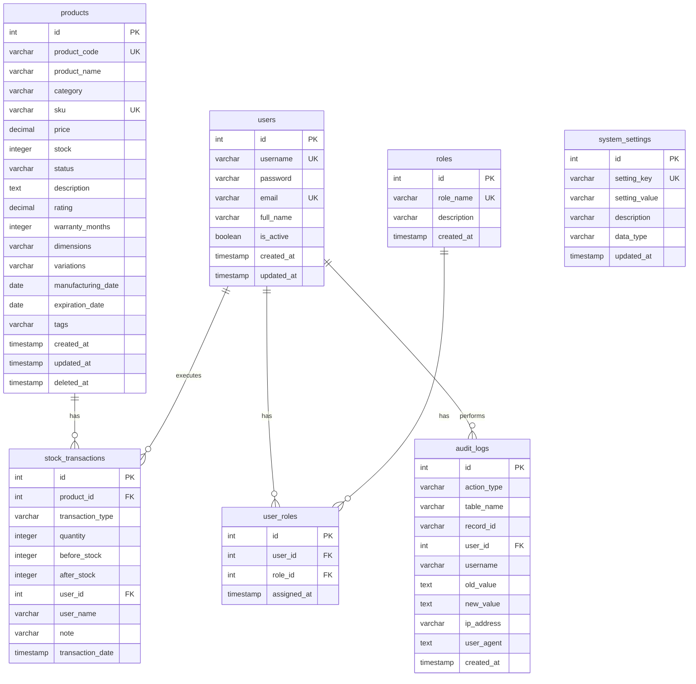

# データベース設計書（ER図）

## 目次
- [1. 基本情報](#1-基本情報)
- [2. データベース概要](#2-データベース概要)
- [3. ER図](#3-er図)
- [4. テーブル一覧](#4-テーブル一覧)
- [5. テーブル定義](#5-テーブル定義)
- [6. リレーションシップ定義](#6-リレーションシップ定義)
- [7. インデックス定義](#7-インデックス定義)
- [8. 制約条件](#8-制約条件)

---

## 1. 基本情報

| 項目 | 内容 |
|------|------|
| データベース名 | inventory_management_db |
| RDBMS | PostgreSQL 14+ / MySQL 8+ |
| 文字コード | UTF-8 |
| タイムゾーン | Asia/Tokyo (JST) |
| 作成日 | 2026年2月4日 |
| 更新日 | 2026年2月4日 |
| バージョン | 1.0 |

---

## 2. データベース概要

本データベースは商品在庫管理システムのためのデータベースです。商品管理、在庫管理、ユーザー管理、権限管理、監査ログの5つの主要機能をサポートします。

### 2.1 主要機能

| 機能 | 説明 | 関連テーブル |
|------|------|-------------|
| 商品管理 | 商品の登録・更新・削除（論理削除） | products |
| 在庫管理 | 在庫の入出庫履歴管理 | stock_transactions |
| ユーザー管理 | ユーザーの登録・認証 | users, roles, user_roles |
| システム設定 | 在庫アラート閾値などの設定管理 | system_settings |
| 監査ログ | 重要操作の記録と追跡 | audit_logs |

### 2.2 データ整合性

| 項目 | 対応 |
|------|------|
| 参照整合性 | 外部キー制約により保証 |
| トランザクション | ACID特性をサポート |
| 論理削除 | deleted_atカラムで対応（products） |
| 監査証跡 | 作成日時・更新日時を全テーブルで記録 |

---

## 3. ER図

### 3.1 ER図（Mermaid記法）



### 3.2 ER図（テキスト表現）

```
┌─────────────────┐
│    products     │
│  (商品マスタ)    │
└────────┬────────┘
         │ 1
         │
         │ has
         │
         │ N
┌────────▼─────────────┐
│ stock_transactions   │
│   (在庫履歴)          │
└──────────────────────┘
         △
         │ N
         │
         │ executes
         │
         │ 1
┌────────┴────────┐         ┌─────────────────┐
│     users       │ 1     N │   user_roles    │ N     1 ┌────────────┐
│ (ユーザーマスタ)  ├─────────┤ (ユーザーロール)  ├─────────┤   roles    │
└────────┬────────┘  has    └─────────────────┘   has   │ (ロール)    │
         │                                                └────────────┘
         │ 1
         │
         │ performs
         │
         │ N
┌────────▼────────┐
│   audit_logs    │
│   (監査ログ)     │
└─────────────────┘

┌───────────────────┐
│ system_settings   │
│ (システム設定)     │
│  (独立テーブル)    │
└───────────────────┘
```

---

## 4. テーブル一覧

| No | テーブル名 | 論理名 | 説明 | レコード数見込み |
|----|-----------|--------|------|-----------------|
| 1 | products | 商品マスタ | 商品の基本情報・詳細情報を管理 | 1,000〜10,000件 |
| 2 | stock_transactions | 在庫履歴 | 入庫・出庫・調整の履歴を記録 | 10,000〜100,000件 |
| 3 | users | ユーザーマスタ | システム利用者の情報を管理 | 10〜100件 |
| 4 | roles | ロールマスタ | 権限ロールを管理 | 2〜10件 |
| 5 | user_roles | ユーザーロール関連 | ユーザーとロールの関連を管理 | 10〜100件 |
| 6 | system_settings | システム設定 | システム全体の設定を管理 | 10〜50件 |
| 7 | audit_logs | 監査ログ | 重要操作のログを記録 | 10,000〜1,000,000件 |

---

## 5. テーブル定義

### 5.1 products（商品マスタ）

| No | カラム名            | データ型       | NULL     | デフォルト値       | 制約               | 説明                     |
|----|---------------------|---------------|----------|--------------------|--------------------|--------------------------|
| 1  | id                  | INT           | NOT NULL | AUTO_INCREMENT     | PK                | AutoIncrement ID（主キー）|
| 2  | product_code        | VARCHAR(8)    | NOT NULL | -                  | UNIQUE            | 商品コード、8文字の英数字  |
| 3  | product_name        | VARCHAR(100)  | NOT NULL | -                  |                    | 商品名                   |
| 4  | category            | VARCHAR(50)   | NOT NULL | -                  |                    | カテゴリ（Electronics/Clothing/Home Appliances） |
| 5  | sku                 | VARCHAR(50)   | NULL     | NULL               | UNIQUE            | SKU（在庫管理番号）      |
| 6  | price               | DECIMAL(12,2) | NOT NULL | 0.00               | CHECK (price >= 0)| 価格（円）               |
| 7  | stock               | INTEGER       | NOT NULL | 0                  | CHECK (stock >= 0)| 在庫数                   |
| 8  | status              | VARCHAR(20)   | NOT NULL | 'active'           |                    | ステータス（active/inactive/deleted） |
| 9  | description         | TEXT          | NULL     | NULL               |                    | 商品説明                 |
| 10 | rating              | DECIMAL(2,1)  | NULL     | NULL               | CHECK (rating >= 0 AND rating <= 5) | 商品評価（0.0〜5.0） |
| 11 | warranty_months     | INTEGER       | NULL     | NULL               | CHECK (warranty_months >= 0) | 保証期間（ヶ月） |
| 12 | dimensions          | VARCHAR(100)  | NULL     | NULL               |                    | 商品寸法                 |
| 13 | variations          | VARCHAR(200)  | NULL     | NULL               |                    | 色/サイズバリエーション   |
| 14 | manufacturing_date  | DATE          | NULL     | NULL               |                    | 製造日                   |
| 15 | expiration_date     | DATE          | NULL     | NULL               |                    | 有効期限                 |
| 16 | tags                | VARCHAR(200)  | NULL     | NULL               |                    | 商品タグ（カンマ区切り） |
| 17 | created_at          | TIMESTAMP     | NOT NULL | CURRENT_TIMESTAMP  |                    | 登録日時                 |
| 18 | updated_at          | TIMESTAMP     | NOT NULL | CURRENT_TIMESTAMP  |                    | 更新日時                 |

**主キー**：id  
**ユニークキー**：product_code  
**インデックス**：sku, category, status, deleted_at, sku

---

### 5.2 stock_transactions（在庫履歴）

| No | カラム名 | データ型 | NULL | デフォルト値 | 制約 | 説明 |
|----|---------|---------|------|------------|------|------|
| 1 | id | INT | NOT NULL | AUTO_INCREMENT | PK | AutoIncrement ID（主キー） |
| 2 | product_id | INT | NOT NULL | - | FK → products.id | 商品の内部ID（productsテーブルの外部キー） |
| 3 | transaction_type | VARCHAR(20) | NOT NULL | - | CHECK (IN ('IN','OUT','ADJUST')) | 取引種別（入庫/出庫/調整） |
| 4 | quantity | INTEGER | NOT NULL | - | | 数量 |
| 5 | before_stock | INTEGER | NOT NULL | - | CHECK (before_stock >= 0) | 変更前在庫数 |
| 6 | after_stock | INTEGER | NOT NULL | - | CHECK (after_stock >= 0) | 変更後在庫数 |
| 7 | user_id | INT | NOT NULL | - | FK → users.id | 実行ユーザーID |
| 8 | user_name | VARCHAR(100) | NOT NULL | - | | 実行ユーザー名（非正規化） |
| 9 | note | VARCHAR(255) | NULL | NULL | | 備考 |
| 10 | transaction_date | TIMESTAMP | NOT NULL | CURRENT_TIMESTAMP | | 取引日時 |

**主キー**：id  
**外部キー**：
- product_id → products.id
- user_id → users.id

**インデックス**：product_id, user_id, transaction_date, transaction_type

---

### 5.3 users（ユーザーマスタ）

| No | カラム名 | データ型 | NULL | デフォルト値 | 制約 | 説明 |
|----|---------|---------|------|------------|------|------|
| 1 | id | INT | NOT NULL | AUTO_INCREMENT | PK | ユーザーID |
| 2 | username | VARCHAR(50) | NOT NULL | - | UNIQUE | ユーザー名（ログインID） |
| 3 | password | VARCHAR(255) | NOT NULL | - | | パスワード（BCrypt暗号化） |
| 4 | email | VARCHAR(100) | NOT NULL | - | UNIQUE | メールアドレス |
| 5 | full_name | VARCHAR(100) | NOT NULL | - | | 氏名 |
| 6 | is_active | BOOLEAN | NOT NULL | TRUE | | アクティブフラグ |
| 7 | created_at | TIMESTAMP | NOT NULL | CURRENT_TIMESTAMP | | 登録日時 |
| 8 | updated_at | TIMESTAMP | NOT NULL | CURRENT_TIMESTAMP | | 更新日時 |

**主キー**：id  
**ユニークキー**：username, email  
**インデックス**：username, email, is_active

---

### 5.4 roles（ロールマスタ）

| No | カラム名 | データ型 | NULL | デフォルト値 | 制約 | 説明 |
|----|---------|---------|------|------------|------|------|
| 1 | id | INT | NOT NULL | AUTO_INCREMENT | PK | ロールID |
| 2 | role_name | VARCHAR(50) | NOT NULL | - | UNIQUE | ロール名（ROLE_USER/ROLE_ADMIN） |
| 3 | description | VARCHAR(200) | NULL | NULL | | ロールの説明 |
| 4 | created_at | TIMESTAMP | NOT NULL | CURRENT_TIMESTAMP | | 登録日時 |

**主キー**：id  
**ユニークキー**：role_name  
**インデックス**：role_name

**初期データ**：

| id | role_name | description |
|---------|-----------|-------------|
| 1 | ROLE_USER | 一般ユーザー |
| 2 | ROLE_ADMIN | 管理者 |

---

### 5.5 user_roles（ユーザーロール関連）

| No | カラム名 | データ型 | NULL | デフォルト値 | 制約 | 説明 |
|----|---------|---------|------|------------|------|------|
| 1 | id | INT | NOT NULL | AUTO_INCREMENT | PK | ユーザーロールID |
| 2 | user_id | INT | NOT NULL | - | FK → users.id | ユーザーID |
| 3 | role_id | INT | NOT NULL | - | FK → roles.id | ロールID |
| 4 | assigned_at | TIMESTAMP | NOT NULL | CURRENT_TIMESTAMP | | 割り当て日時 |

**主キー**：id  
**ユニークキー**：(user_id, role_id) - 複合ユニークキー  
**外部キー**：
- user_id → users.id
- role_id → roles.id

**インデックス**：user_id, role_id

---

### 5.6 system_settings（システム設定）

| No | カラム名 | データ型 | NULL | デフォルト値 | 制約 | 説明 |
|----|---------|---------|------|------------|------|------|
| 1 | id | INT | NOT NULL | AUTO_INCREMENT | PK | 設定ID |
| 2 | setting_key | VARCHAR(100) | NOT NULL | - | UNIQUE | 設定キー |
| 3 | setting_value | VARCHAR(500) | NOT NULL | - | | 設定値 |
| 4 | description | VARCHAR(200) | NULL | NULL | | 説明 |
| 5 | data_type | VARCHAR(20) | NOT NULL | 'STRING' | CHECK (IN ('STRING','INTEGER','BOOLEAN','DECIMAL')) | データ型 |
| 6 | updated_at | TIMESTAMP | NOT NULL | CURRENT_TIMESTAMP | | 更新日時 |

**主キー**：id  
**ユニークキー**：setting_key  
**インデックス**：setting_key

**初期データ**：

| setting_key | setting_value | description | data_type |
|-------------|---------------|-------------|-----------|
| stock_warning_threshold | 20 | 在庫不足閾値 | INTEGER |
| stock_critical_threshold | 0 | 在庫切れ閾値 | INTEGER |
| session_timeout_minutes | 30 | セッションタイムアウト（分） | INTEGER |
| max_login_attempts | 5 | 最大ログイン試行回数 | INTEGER |

---

### 5.7 audit_logs（監査ログ）

| No | カラム名 | データ型 | NULL | デフォルト値 | 制約 | 説明 |
|----|---------|---------|------|------------|------|------|
| 1 | id | INT | NOT NULL | AUTO_INCREMENT | PK | ログID |
| 2 | action_type | VARCHAR(50) | NOT NULL | - | | アクション種別（CREATE/UPDATE/DELETE/LOGIN） |
| 3 | table_name | VARCHAR(50) | NOT NULL | - | | 対象テーブル名 |
| 4 | record_id | VARCHAR(50) | NOT NULL | - | | 対象レコードID |
| 5 | user_id | INT | NULL | NULL | FK → users.id | 実行ユーザーID |
| 6 | username | VARCHAR(50) | NOT NULL | - | | 実行ユーザー名（非正規化） |
| 7 | old_value | TEXT | NULL | NULL | | 変更前の値（JSON形式） |
| 8 | new_value | TEXT | NULL | NULL | | 変更後の値（JSON形式） |
| 9 | ip_address | VARCHAR(45) | NULL | NULL | | IPアドレス（IPv6対応） |
| 10 | user_agent | TEXT | NULL | NULL | | ユーザーエージェント |
| 11 | created_at | TIMESTAMP | NOT NULL | CURRENT_TIMESTAMP | | 実行日時 |

**主キー**：id  
**外部キー**：
- user_id → users.id（NULLを許可）

**インデックス**：action_type, table_name, record_id, user_id, created_at

---

## 6. リレーションシップ定義

### 6.1 リレーションシップ一覧

| No | 親テーブル | 子テーブル | リレーション | カーディナリティ | 外部キー | 説明 |
|----|-----------|-----------|-------------|-----------------|---------|------|
| 1 | products | stock_transactions | 1:N | 1商品 : N履歴 | product_id | 商品の在庫変動履歴 |
| 2 | users | stock_transactions | 1:N | 1ユーザー : N履歴 | user_id | ユーザーが実行した在庫操作 |
| 3 | users | user_roles | 1:N | 1ユーザー : Nロール | user_id | ユーザーに割り当てられたロール |
| 4 | roles | user_roles | 1:N | 1ロール : Nユーザー | role_id | ロールを持つユーザー |
| 5 | users | audit_logs | 1:N | 1ユーザー : Nログ | user_id | ユーザーが実行した操作ログ |

### 6.2 詳細リレーションシップ定義

#### 6.2.1 products → stock_transactions

| 項目 | 内容 |
|------|------|
| 親テーブル | products |
| 子テーブル | stock_transactions |
| 親カラム | id |
| 子カラム | product_id |
| リレーション種別 | 1:N（一対多） |
| ON DELETE | RESTRICT（削除時エラー） |
| ON UPDATE | CASCADE（更新時連動） |
| 説明 | 1つの商品は複数の在庫履歴を持つ<br>商品が削除される場合、先に履歴を確認する必要がある |

#### 6.2.2 users → stock_transactions

| 項目 | 内容 |
|------|------|
| 親テーブル | users |
| 子テーブル | stock_transactions |
| 親カラム | id |
| 子カラム | user_id |
| リレーション種別 | 1:N（一対多） |
| ON DELETE | RESTRICT（削除時エラー） |
| ON UPDATE | CASCADE（更新時連動） |
| 説明 | 1人のユーザーは複数の在庫操作を実行できる<br>ユーザー削除時は履歴を保持するため削除不可 |

#### 6.2.3 users → user_roles

| 項目 | 内容 |
|------|------|
| 親テーブル | users |
| 子テーブル | user_roles |
| 親カラム | id |
| 子カラム | user_id |
| リレーション種別 | 1:N（一対多） |
| ON DELETE | CASCADE（連動削除） |
| ON UPDATE | CASCADE（更新時連動） |
| 説明 | 1人のユーザーは複数のロールを持てる<br>ユーザー削除時はロール関連も削除 |

#### 6.2.4 roles → user_roles

| 項目 | 内容 |
|------|------|
| 親テーブル | roles |
| 子テーブル | user_roles |
| 親カラム | id |
| 子カラム | role_id |
| リレーション種別 | 1:N（一対多） |
| ON DELETE | RESTRICT（削除時エラー） |
| ON UPDATE | CASCADE（更新時連動） |
| 説明 | 1つのロールは複数のユーザーに割り当て可能<br>使用中のロールは削除不可 |

#### 6.2.5 users → audit_logs

| 項目 | 内容 |
|------|------|
| 親テーブル | users |
| 子テーブル | audit_logs |
| 親カラム | id |
| 子カラム | user_id |
| リレーション種別 | 1:N（一対多） |
| ON DELETE | SET NULL（NULL設定） |
| ON UPDATE | CASCADE（更新時連動） |
| 説明 | 1人のユーザーは複数の操作ログを持つ<br>ユーザー削除時もログは保持（user_idはNULL） |

---

## 7. インデックス定義

### 7.1 インデックス一覧

| No | テーブル名 | インデックス名 | カラム | 種別 | 説明 |
|----|-----------|---------------|--------|------|------|
| 1 | products | pk_products | id | PRIMARY | 主キー |
| 2 | products | uk_products_sku | sku | UNIQUE | SKUの一意性保証 |
| 3 | products | idx_products_category | category | INDEX | カテゴリ検索用 |
| 4 | products | idx_products_status | status | INDEX | ステータス検索用 |
| 5 | products | idx_products_deleted | deleted_at | INDEX | 論理削除フィルタ用 |
| 6 | stock_transactions | pk_stock_trans | id | PRIMARY | 主キー |
| 7 | stock_transactions | fk_stock_trans_product | product_id | INDEX | 商品別履歴検索用 |
| 8 | stock_transactions | fk_stock_trans_user | user_id | INDEX | ユーザー別履歴検索用 |
| 9 | stock_transactions | idx_stock_trans_date | transaction_date | INDEX | 日付範囲検索用 |
| 10 | stock_transactions | idx_stock_trans_type | transaction_type | INDEX | 種別検索用 |
| 11 | users | pk_users | id | PRIMARY | 主キー |
| 12 | users | uk_users_username | username | UNIQUE | ユーザー名の一意性保証 |
| 13 | users | uk_users_email | email | UNIQUE | メールアドレスの一意性保証 |
| 14 | users | idx_users_active | is_active | INDEX | アクティブユーザー検索用 |
| 15 | roles | pk_roles | id | PRIMARY | 主キー |
| 16 | roles | uk_roles_name | role_name | UNIQUE | ロール名の一意性保証 |
| 17 | user_roles | pk_user_roles | id | PRIMARY | 主キー |
| 18 | user_roles | uk_user_roles | (user_id, role_id) | UNIQUE | ユーザー・ロールの組み合わせ一意性 |
| 19 | user_roles | fk_user_roles_user | user_id | INDEX | ユーザー別ロール検索用 |
| 20 | user_roles | fk_user_roles_role | role_id | INDEX | ロール別ユーザー検索用 |
| 21 | system_settings | pk_settings | id | PRIMARY | 主キー |
| 22 | system_settings | uk_settings_key | setting_key | UNIQUE | 設定キーの一意性保証 |
| 23 | audit_logs | pk_audit_logs | id | PRIMARY | 主キー |
| 24 | audit_logs | idx_audit_action | action_type | INDEX | アクション種別検索用 |
| 25 | audit_logs | idx_audit_table | table_name | INDEX | テーブル別ログ検索用 |
| 26 | audit_logs | idx_audit_record | record_id | INDEX | レコード別ログ検索用 |
| 27 | audit_logs | idx_audit_user | user_id | INDEX | ユーザー別ログ検索用 |
| 28 | audit_logs | idx_audit_date | created_at | INDEX | 日付範囲検索用 |
| 29 | audit_logs | idx_audit_composite | (table_name, record_id, created_at) | COMPOSITE | 複合検索用 |

### 7.2 パフォーマンスチューニング推奨事項

| テーブル | 推奨事項 |
|---------|---------|
| products | ・category、statusでフィルタリングが多い場合は複合インデックス検討<br>・deleted_atでのフィルタは頻繁に使用されるため必須 |
| stock_transactions | ・レコード数が多くなるため、パーティショニング検討<br>・古いデータはアーカイブテーブルへ移行 |
| audit_logs | ・レコード数が非常に多くなるため、日付でのパーティショニング必須<br>・1年以上古いログは別ストレージへアーカイブ |

---

## 8. 制約条件

### 8.1 CHECK制約一覧

| テーブル | カラム | 制約 | 説明 |
|---------|--------|------|------|
| products | price | price >= 0 | 価格は0以上 |
| products | stock | stock >= 0 | 在庫数は0以上 |
| products | rating | rating >= 0 AND rating <= 5 | 評価は0.0〜5.0の範囲 |
| products | warranty_months | warranty_months >= 0 | 保証期間は0以上 |
| stock_transactions | transaction_type | transaction_type IN ('IN','OUT','ADJUST') | 取引種別は3種類のみ |
| stock_transactions | before_stock | before_stock >= 0 | 変更前在庫数は0以上 |
| stock_transactions | after_stock | after_stock >= 0 | 変更後在庫数は0以上 |
| system_settings | data_type | data_type IN ('STRING','INTEGER','BOOLEAN','DECIMAL') | データ型は4種類のみ |

### 8.2 NOT NULL制約

| テーブル | 必須カラム | 説明 |
|---------|-----------|------|
| products | id, product_code, product_name, category, price, stock, status | 商品の基本情報は必須 |
| stock_transactions | id, product_id, transaction_type, quantity, before_stock, after_stock, user_id, user_name, transaction_date | 在庫履歴の全項目（noteを除く）は必須 |
| users | id, username, password, email, full_name, is_active | ユーザーの全項目（削除関連を除く）は必須 |
| roles | id, role_name | ロールの基本項目は必須 |
| user_roles | id, user_id, role_id | ユーザーロール関連の全項目は必須 |
| system_settings | id, setting_key, setting_value, data_type | 設定の基本項目は必須 |
| audit_logs | id, action_type, table_name, record_id, username, created_at | ログの基本項目は必須 |

### 8.3 UNIQUE制約

| テーブル | カラム | 説明 |
|---------|--------|------|
| products | sku | SKUは重複不可 |
| users | username | ユーザー名は重複不可 |
| users | email | メールアドレスは重複不可 |
| roles | role_name | ロール名は重複不可 |
| user_roles | (user_id, role_id) | 同じユーザー・ロールの組み合わせは1つのみ |
| system_settings | setting_key | 設定キーは重複不可 |

### 8.4 外部キー制約

| 子テーブル | 子カラム | 親テーブル | 親カラム | ON DELETE | ON UPDATE |
|-----------|---------|-----------|---------|-----------|-----------|
| stock_transactions | product_id | products | id | RESTRICT | CASCADE |
| stock_transactions | user_id | users | id | RESTRICT | CASCADE |
| user_roles | user_id | users | id | CASCADE | CASCADE |
| user_roles | role_id | roles | id | RESTRICT | CASCADE |
| audit_logs | user_id | users | id | SET NULL | CASCADE |

---

## 9. データ保守

### 9.1 定期メンテナンス

| 項目 | 頻度 | 内容 |
|------|------|------|
| audit_logsのアーカイブ | 月次 | 1年以上古いログを別テーブルへ移行 |
| stock_transactionsのアーカイブ | 年次 | 3年以上古い履歴を別テーブルへ移行 |
| インデックスの再構築 | 月次 | 全テーブルのインデックスを最適化 |
| 統計情報の更新 | 週次 | クエリ最適化のための統計情報更新 |

### 9.2 バックアップ戦略

| 項目 | 頻度 | 保持期間 |
|------|------|---------|
| フルバックアップ | 日次 | 30日間 |
| 増分バックアップ | 時間次 | 7日間 |
| トランザクションログ | リアルタイム | 7日間 |

---

## 10. 補足事項

### 10.1 データ型の選択基準

| データ型 | 使用基準 |
|---------|---------|
| VARCHAR | 可変長文字列、最大長が明確な場合 |
| TEXT | 可変長文字列、最大長が不明確な場合 |
| INTEGER | 整数値、範囲は-2,147,483,648〜2,147,483,647 |
| BIGINT | 大きな整数値、AUTO_INCREMENTに推奨 |
| DECIMAL | 金額など精度が必要な数値 |
| BOOLEAN | 真偽値 |
| TIMESTAMP | 日時、タイムゾーン考慮 |
| DATE | 日付のみ |

### 10.2 命名規則

| 項目 | 規則 | 例 |
|------|------|-----|
| テーブル名 | 小文字、複数形、スネークケース | products, stock_transactions |
| カラム名 | 小文字、スネークケース | product_id, user_name |
| 主キー | テーブル名の単数形 + _id | product_id, user_id |
| 外部キー | 参照先テーブル名の単数形 + _id | product_id, user_id |
| インデックス名 | 種別_テーブル名_カラム名 | idx_products_category, uk_users_email |
| 制約名 | 種別_テーブル名_カラム名 | fk_stock_trans_product, chk_price_positive |

### 10.3 セキュリティ考慮事項

| 項目 | 対策 |
|------|------|
| パスワード | BCryptで暗号化、VARCHAR(255)で格納 |
| 個人情報 | 必要最小限のみ保持、アクセス制御 |
| 監査ログ | 変更前後の値をJSON形式で保存 |
| IPアドレス | IPv6対応でVARCHAR(45) |
| セッション | タイムアウト設定、不正アクセス検知 |

---

**文書管理情報**
- **作成者**：システム管理者
- **承認者**：プロジェクトマネージャー
- **配布先**：開発チーム全員、DBエンジニア
- **更新履歴**：
  - 2026年2月4日：初版作成
