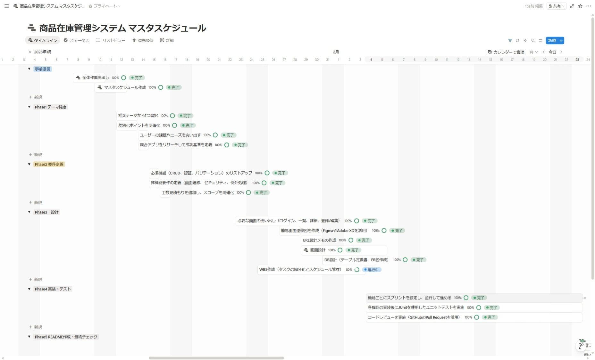

# Inventory Management System

## サービス概要

小売・倉庫業務で発生しやすい「在庫の見えにくさ」「更新履歴の不透明さ」「運用の属人化」を解消するために開発した、ロールベース対応の在庫管理 Web アプリケーションです。  
一般ユーザーは在庫の閲覧・更新、管理者は商品・在庫・ユーザー管理を一元的に行えます。

---

## デプロイ・アクセス

**動作テスト環境（Heroku）:** <a href="https://inventory-0543a8a3f8cf.herokuapp.com/login" target="_blank" rel="noopener">https://inventory-0543a8a3f8cf.herokuapp.com/login</a>  
テスト環境サーバは、午前9時～午後7時のみ起動しています。  
テスト環境のデータはすべてテスト用データのため、新規登録・更新・削除はすべて問題ありません。

### テストアカウント

| ロール | ユーザー名 | パスワード | 説明 |
|--------|----------|---------|------|
| 一般ユーザー | `testuser` | `TestUser1!` | 在庫閲覧・更新機能にアクセス可能 |
| 管理者 | `adminuser` | `TestUser1!` | 商品・ユーザー・在庫管理機能にアクセス可能 |

---

## 開発背景

知人の倉庫業務では、在庫管理が紙台帳と Excel を中心に運用されており、日々の作業は回っている一方で「情報の更新・共有・追跡」に時間がかかる状態でした。  
特に、入出庫の記録が担当者ごとに分かれてしまうため、在庫に差異が出たときに原因をすぐ特定できないことがありました。

現場で実際に発生していた主な課題は次のとおりです。

- 誰がいつ在庫を更新したかを追跡しづらい
- 欠品・低在庫の把握が遅れ、発注判断が後手に回る
- 商品管理・ユーザー管理が分散し、運用負荷が高い

これらの課題に対して、本プロジェクトでは「在庫データを一元管理し、履歴と権限を明確にする」ことを軸に設計しました。  
実務に近い題材をもとに、要件整理から設計・実装・テストまで一貫して取り組むことで、業務改善に直結するシステム開発力を高めることを目的としています。

---

## 解決した課題

### 現場スタッフ（一般ユーザー）

- 在庫管理のために在庫情報を一元管理されていない
- 更新履歴が残らず、変更の責任所在が曖昧
- 低在庫の報告が口頭中心で記録が残らない

### 管理者

- 商品の追加・変更・廃番対応が分散している
- ユーザー管理を都度、マネージャー担当に依頼する必要がある
- 低在庫・欠品の一覧把握が難しい

---

## 主要機能

### 認証・セキュリティ

- ユーザーログイン / 管理者ログイン（`/admin/login`）
- Remember-Me（24時間）
- ブルートフォース対策（5回失敗で24時間ロック）
- パスワード変更機能

### 一般ユーザー機能

- 在庫一覧（キーワード・カテゴリ・在庫状態で絞り込み）
- 在庫更新（入庫 / 出庫 / 数量設定）
- 低在庫バッジ表示（不足件数・欠品件数）
- 在庫更新履歴の時系列確認

### 管理者機能

- 商品 CRUD（論理削除・復元含む）
- 在庫の一括確認・更新・履歴閲覧
- ユーザー一覧・登録・ロール変更・削除
- 在庫 REST API（JSON で取得・更新）

---

## 画面デモ（画像クリックで拡大されます）

| ログイン画面 | 在庫一覧・詳細 |
| :---: | :---: |
|  |  |
| 
ユーザー名・パスワードを入力してログイン。Remember-Me（24時間）対応。ブルートフォース対策（5回失敗で24時間ロック）を実装。
 | 
キーワード・カテゴリ・在庫状態で絞り込み。低在庫バッジ（欠品・不足件数）を一覧上部に表示。在庫数リンクから詳細・更新履歴を確認。
 |
| 在庫更新（入庫 / 出庫） | 管理者在庫管理画面 |
|  |  |
| 
在庫更新モーダルから入庫 / 出庫 / 数量設定が可能。更新と同時に stock_transactions へ履歴を記録。
 | 
管理者は商品の編集・削除・詳細確認・在庫履歴の閲覧が可能。新規商品登録ボタンから登録フローへ遷移。商品 CRUD・ユーザー管理も管理者メニューから一元操作。
 |

---

## 設計・実装で重視したポイント

### 1. 権限管理の二重防御（安全性）

権限管理は設計上の重要方針です（詳細は下の「セキュリティ対策（防御一覧）」セクションを参照）。

### 2. 在庫更新の整合性確保（正確性）

- `stock_transactions` に `CHECK (transaction_type IN ('in','out'))` を設定
- `set` 操作は更新前後差分から `in/out` に変換して履歴記録
- 在庫更新と履歴登録を `@Transactional` で1トランザクション化

### 3. 責務分離しやすい3層構成（保守性）

- Controller: リクエスト受付・レスポンス構築
- Service: 在庫計算、バリデーション、権限制御
- Repository: JPA/JPQL によるデータアクセス

処理責務を分離することで、機能追加時の影響範囲を限定し、テストしやすい構成にしています。

### 4. 例外処理の一元化（運用性）

- `@ControllerAdvice` により 400 / 403 / 404 / 500 を集約ハンドリング
- スタックトレースをユーザーに露出せず、適切なエラーページを返却

### 5. 環境分離とシークレット管理（本番運用）

- `dev / prod / test` プロファイルを分離
- Remember-Me 署名鍵や DB 認証情報は環境変数から取得
- `prod` 起動時は必須プロパティの存在チェックを実施

### 6. セキュリティ対策（防御一覧）
| カテゴリ | 対策・技術 |
| --- | --- |
| 認証・パスワード保護 | BCrypt(12) ハッシュ、Remember-Me 署名鍵は環境変数で管理、セッション固定化対策 |
| 権限検査 | URL レベルと Service レベルの二重チェック（/admin/** 制限） |
| ブルートフォース対策 | `LoginAttemptService` による失敗回数制限（5回でロック） |
| CSRF 保護 | 全フォームおよび状態変更リクエストで CSRF トークン検証（`CsrfConfig`） |
| XSS 対策 | Thymeleaf の自動エスケープ、入力バリデーション、Content Security Policy（CSP） |
| SQL インジェクション対策 | Spring Data JPA とパラメタ化クエリを利用、動的 SQL の直接組立てを回避 |
| 安全な HTTP ヘッダ | HSTS、X-Content-Type-Options、X-Frame-Options などを適用 |
| Cookie / セッション保護 | `Secure` / `HttpOnly` / `SameSite` の適用、署名付き Remember-Me クッキー |
| 監査ログ・操作履歴 | 在庫更新は `stock_transactions` に永続化し、誰がいつ行ったかを追跡可能にする |
| エラーハンドリング | `GlobalExceptionHandler` で詳細を非表示にしつつ適切にログ出力 |
| 最小権限の原則 | ロールの分離とサービス層での細かい権限制御を設計に組み込む |
| API 保護 | REST API に対する認証・認可を必須化、必要に応じてレート制限を適用 |

---

## テスト方針

- 単体テスト: Service 層（JUnit 5 / Mockito）
- コントローラーテスト: MockMvc
- 統合テスト: `@SpringBootTest` + H2（MySQL互換モード）
- システムテスト：想定ケースシナリオを作成して、WEB画面操作での動作確認

テストプロファイルで本番 DB 非依存の検証を行い、`@Transactional` によるロールバックでテスト独立性を確保しています。  
カバレッジ目標は 80% 以上（JaCoCo）で、今回実測値（Line Coverage）は **88.80%**（1395/1571）です。

詳細レポートはリポジトリ内に保存しています
- JaCoCo カバレッジ結果の説明: <a href="Doc/Testing/jacoco-report/jacoco.md" target="_blank" rel="noopener">Doc/Testing/jacoco-report/jacoco.md</a>
- JaCoCo カバレッジデータ（CSV）: <a href="Doc/Testing/jacoco-report/jacoco.csv" target="_blank" rel="noopener">Doc/Testing/jacoco-report/jacoco.csv</a>

---

## 技術スタック

| カテゴリ | 技術 |
| --- | --- |
| バックエンド | Java 21 / Spring Boot 4.0.2 / Spring Security 7.x |
| データアクセス | Spring Data JPA / Hibernate / MySQL 8.0 |
| フロントエンド | Thymeleaf / Bootstrap 5.2.3 / Bootstrap Icons 1.10.0 / Vanilla JS |
| セキュリティ | BCrypt(12) / CSRF / CSP / HSTS / Remember-Me |
| テスト | JUnit 5 / Mockito / MockMvc / H2 |
| ビルド | Maven Wrapper |
| 開発環境 | Windows 11 / JDK 21 |

### 技術選定理由

**【バックエンド：Java 21 / Spring Boot 4.x】**  
業務システムの開発現場で広く採用されている Java を選択しました。Spring Boot は「設定より規約」の思想により、セキュリティ・データアクセス・DI などのインフラ部分を迅速に構築でき、ビジネスロジックの実装に集中できます。また、Java 21 の LTS 版を採用することで、長期サポートと安定性を確保しています。

**【セキュリティ：Spring Security 7.x】**  
認証・認可・CSRF・セッション管理といったセキュリティ機能を一元的に提供する Spring Security を採用しました。個別に実装すると実装ミスが生じやすいセキュリティ機能を、フレームワークレベルで担保できる点が選択理由です。ロールベースの認可制御（`ROLE_USER` / `ROLE_ADMIN`）や BCrypt によるパスワードハッシュをシームレスに統合できます。

**【データアクセス：Spring Data JPA / Hibernate / MySQL 8.0】**  
Spring Data JPA により、定型的な CRUD 操作はインターフェース定義だけで実現できるため、実装コストを抑えつつ可読性を高めています。複雑な検索条件には `@Query` による JPQL を使用し、動的 SQL の直接組み立てを避けることで SQL インジェクション対策も兼ねています。DB は実務で広く使われる MySQL 8.0 を採用し、本番環境に近い構成で開発しました。

**【フロントエンド：Thymeleaf / Bootstrap 5.2.3 / Vanilla JS】**  
ポートフォリオの目的は「バックエンド・設計スキルの証明」であるため、フロントエンドに過剰なコストをかけないよう、Spring Boot と親和性の高い Thymeleaf を選択しました。Bootstrap により統一された UI を最小コストで実現し、JavaScript は jQuery に依存しない Vanilla JS で記述することで、DOM 操作の基礎理解を示しています。React や Next.js への移行は今後の改善予定として位置づけています。

**【テスト：JUnit 5 / Mockito / H2】**  
Service 層の単体テストには Mockito でモックを活用し、外部依存を排除した純粋なロジック検証を行っています。統合テストでは H2 インメモリ DB（MySQL 互換モード）を使用することで、ローカル環境・CI 環境を問わずDBに依存しないテスト実行を実現しました。カバレッジは JaCoCo で計測し、目標 80% に対して今回実測値（Line Coverage）は **88.80%**（1395/1571）です。

---

## システム構成

（図：アプリケーションの主要レイヤーとデータフロー）

---

## ER図

(図：主要テーブルとリレーションの概要)

主要テーブル:

- `users`: ユーザー情報・ロール管理
- `products`: 商品マスタ（論理削除対応）
- `stock_transactions`: 在庫入出庫履歴 

---

## 開発の流れ、作成ドキュメント、開発マスタスケジュール

開発は次の順序で進め、各工程に対応するドキュメントを作成・管理しました（主要ファイルを併記）。必要に応じて各ドキュメントの最新版は <a href="Doc/" target="_blank" rel="noopener">こちら</a> に保管しています。
- 開発テーマ（商品在庫管理システム） — 在庫の可視化と運用効率化を目的とし、リアルタイム在庫表示・入出庫履歴管理・自動計算・CSV入出力を主要機能とする — <a href="Doc/Planning_Requirements/開発テーマドキュメント資料/theme_overview.md" target="_blank" rel="noopener">開発テーマ資料</a>
- 要件定義（ユーザー要件の整理・優先度付け） — <a href="Doc/Planning_Requirements/要件定義資料/requirements_definition.md" target="_blank" rel="noopener">要件定義資料</a>
- 設計（画面・API・DB設計） — <a href="Doc/SystemDesign" target="_blank" rel="noopener">設計書フォルダ</a>
- 製造（コーディング） — <a href="Doc/Planning_Requirements/AI利用開発プロンプト.md" target="_blank" rel="noopener">AI利用開発プロンプト</a>
- テスト（開発段階：単体・結合テスト） — <a href="src/test/java/com/inventory/inventory_management/" target="_blank" rel="noopener">テストフォルダ</a>
- テスト（本番想定：システムテスト） — <a href="Doc/Testing/" target="_blank" rel="noopener">ドキュメントフォルダ</a>

事前に開発マスタスケジュールおよび機能開発WBSを作成し、これらに従って進捗管理・レビューを実施しました。WBS図は下記を参照。

---

## 今後の改善予定

- 在庫アラート通知（メール/画面通知）
- 在庫一覧・履歴の CSV エクスポート
- 商品カテゴリ管理機能
- REST API 拡充 + OpenAPI ドキュメント整備
- Docker 化 + CI/CD パイプライン整備
- フロントのリッチ化（React導入を想定、まずは管理画面で検証）
- 2026年4月中にAWS上へサーバを構築する予定です。

---

## ひとこと

**業務系Webアプリ（Spring Boot / MySQL）の設計・実装・テストを一人でやり切れます。**  
要件定義から詳細設計・実装・テスト・本番運用まで、エンドツーエンドで対応可能です。  
このプロジェクトで実証したセキュリティ・品質・ドキュメント管理を、クライアント案件にも適用します。
