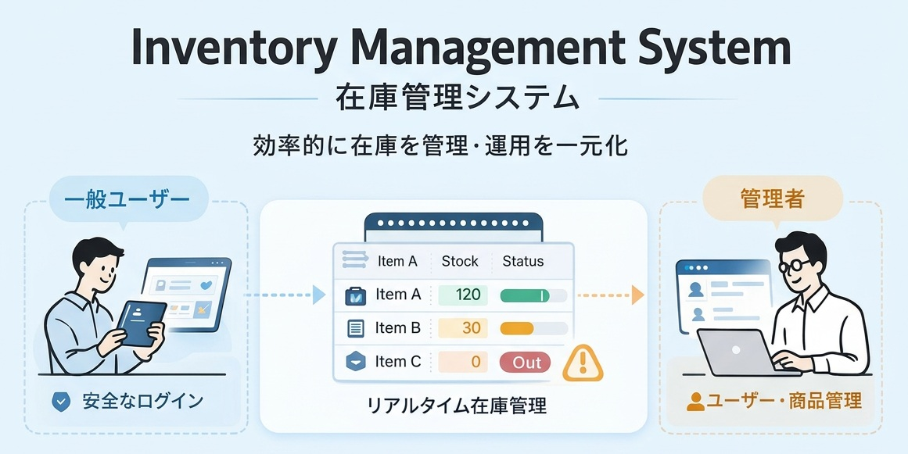
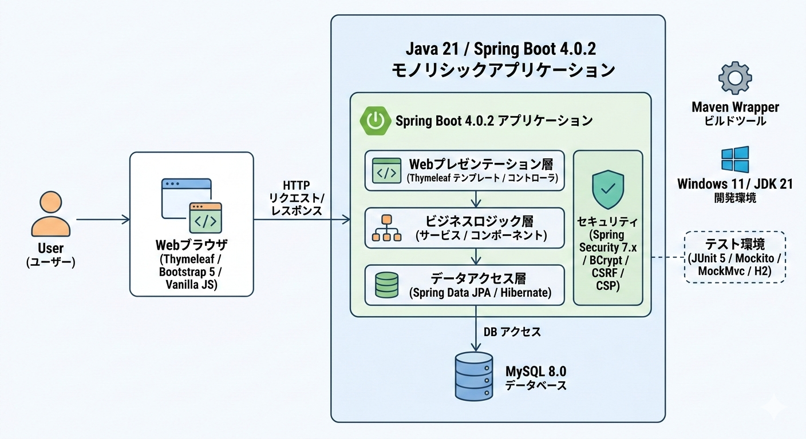
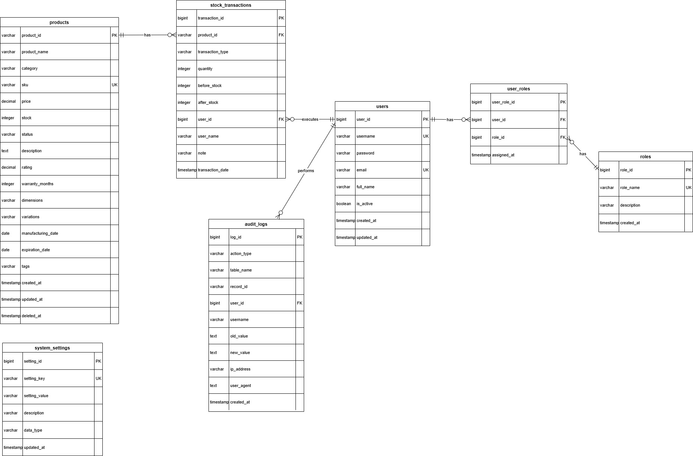
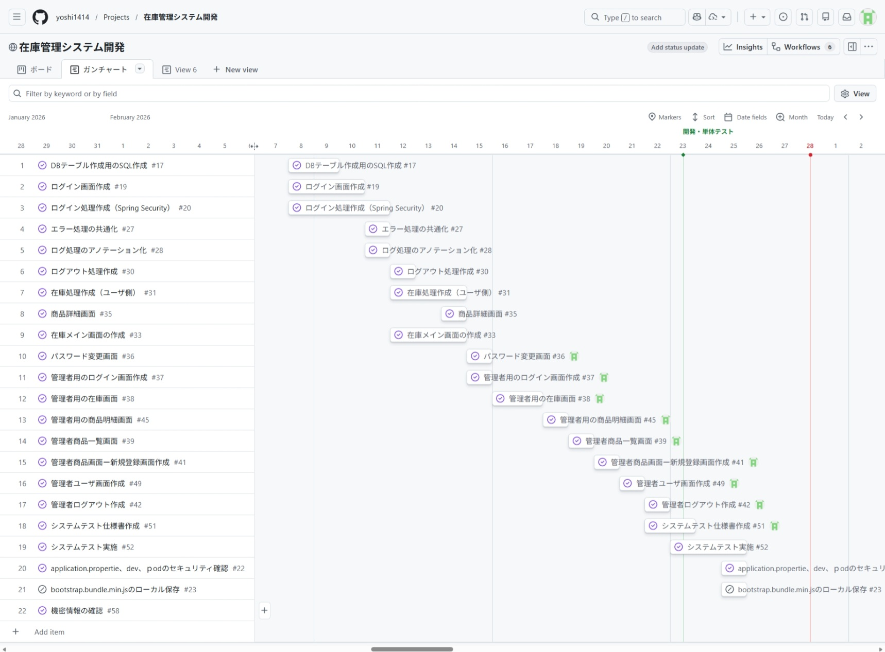

# Inventory Management System

## サービス概要

小売・倉庫業務で発生しやすい「在庫の見えにくさ」「更新履歴の不透明さ」「運用の属人化」を解消するために開発した、ロールベース対応の在庫管理 Web アプリケーションです。  
一般ユーザーは在庫の閲覧・更新、管理者は商品・在庫・ユーザー管理を一元的に行えます。

---

## 開発背景

知人の倉庫業務では、在庫管理が紙台帳と Excel を中心に運用されており、日々の作業は回っている一方で「情報の更新・共有・追跡」に時間がかかる状態でした。  
特に、入出庫の記録が担当者ごとに分かれてしまうため、在庫に差異が出たときに原因をすぐ特定できないことがありました。

現場で実際に発生していた主な課題は次のとおりです。

- 誰がいつ在庫を更新したかを追跡しづらい
- 欠品・低在庫の把握が遅れ、発注判断が後手に回る
- 商品管理・ユーザー管理が分散し、運用負荷が高い

これらの課題に対して、本プロジェクトでは「在庫データを一元管理し、履歴と権限を明確にする」ことを軸に設計しました。  
実務に近い題材をもとに、要件整理から設計・実装・テストまで一貫して取り組むことで、業務改善に直結するシステム開発力を高めることを目的としています。

---

## 解決した課題

### 現場スタッフ（一般ユーザー）

- 在庫管理のために在庫情報を一元管理されていない
- 更新履歴が残らず、変更の責任所在が曖昧
- 低在庫の報告が口頭中心で記録が残らない

### 管理者

- 商品の追加・変更・廃番対応が分散している
- ユーザー管理を都度、マネージャー担当に依頼する必要がある
- 低在庫・欠品の一覧把握が難しい

---

## 主要機能

### 認証・セキュリティ

- ユーザーログイン / 管理者ログイン（`/admin/login`）
- Remember-Me（24時間）
- ブルートフォース対策（5回失敗で24時間ロック）
- パスワード変更機能

### 一般ユーザー機能

- 在庫一覧（キーワード・カテゴリ・在庫状態で絞り込み）
- 在庫更新（入庫 / 出庫 / 数量設定）
- 低在庫バッジ表示（不足件数・欠品件数）
- 在庫更新履歴の時系列確認

### 管理者機能

- 商品 CRUD（論理削除・復元含む）
- 在庫の一括確認・更新・履歴閲覧
- ユーザー一覧・登録・ロール変更・削除
- 在庫 REST API（JSON で取得・更新）

---

## 設計・実装で重視したポイント

### 1. 権限管理の二重防御（安全性）

権限管理は設計上の重要方針です（詳細は下の「セキュリティ対策（防御一覧）」セクションを参照）。

### 2. 在庫更新の整合性確保（正確性）

- `stock_transactions` に `CHECK (transaction_type IN ('in','out'))` を設定
- `set` 操作は更新前後差分から `in/out` に変換して履歴記録
- 在庫更新と履歴登録を `@Transactional` で1トランザクション化

### 3. 責務分離しやすい3層構成（保守性）

- Controller: リクエスト受付・レスポンス構築
- Service: 在庫計算、バリデーション、権限制御
- Repository: JPA/JPQL によるデータアクセス

処理責務を分離することで、機能追加時の影響範囲を限定し、テストしやすい構成にしています。

### 4. 例外処理の一元化（運用性）

- `@ControllerAdvice` により 400 / 403 / 404 / 500 を集約ハンドリング
- スタックトレースをユーザーに露出せず、適切なエラーページを返却

### 5. 環境分離とシークレット管理（本番運用）

- `dev / prod / test` プロファイルを分離
- Remember-Me 署名鍵や DB 認証情報は環境変数から取得
- `prod` 起動時は必須プロパティの存在チェックを実施

### 6. セキュリティ対策（防御一覧）
| カテゴリ | 対策・技術 |
| --- | --- |
| 認証・パスワード保護 | BCrypt(12) ハッシュ、Remember-Me 署名鍵は環境変数で管理、セッション固定化対策 |
| 権限検査 | URL レベルと Service レベルの二重チェック（/admin/** 制限） |
| ブルートフォース対策 | `LoginAttemptService` による失敗回数制限（5回でロック） |
| CSRF 保護 | 全フォームおよび状態変更リクエストで CSRF トークン検証（`CsrfConfig`） |
| XSS 対策 | Thymeleaf の自動エスケープ、入力バリデーション、Content Security Policy（CSP） |
| SQL インジェクション対策 | Spring Data JPA とパラメタ化クエリを利用、動的 SQL の直接組立てを回避 |
| 安全な HTTP ヘッダ | HSTS、X-Content-Type-Options、X-Frame-Options などを適用 |
| Cookie / セッション保護 | `Secure` / `HttpOnly` / `SameSite` の適用、署名付き Remember-Me クッキー |
| 監査ログ・操作履歴 | 在庫更新は `stock_transactions` に永続化し、誰がいつ行ったかを追跡可能にする |
| エラーハンドリング | `GlobalExceptionHandler` で詳細を非表示にしつつ適切にログ出力 |
| 最小権限の原則 | ロールの分離とサービス層での細かい権限制御を設計に組み込む |
| API 保護 | REST API に対する認証・認可を必須化、必要に応じてレート制限を適用 |

---

## テスト方針

- 単体テスト: Service 層（JUnit 5 / Mockito）
- コントローラーテスト: MockMvc
- 統合テスト: `@SpringBootTest` + H2（MySQL互換モード）

テストプロファイルで本番 DB 非依存の検証を行い、`@Transactional` によるロールバックでテスト独立性を確保しています。  
カバレッジ目標は 80% 以上（JaCoCo）です。

---

## 技術スタック

| カテゴリ | 技術 |
| --- | --- |
| バックエンド | Java 21 / Spring Boot 4.0.2 / Spring Security 7.x |
| データアクセス | Spring Data JPA / Hibernate / MySQL 8.0 |
| フロントエンド | Thymeleaf / Bootstrap 5.2.3 / Bootstrap Icons 1.10.0 / Vanilla JS |
| セキュリティ | BCrypt(12) / CSRF / CSP / HSTS / Remember-Me |
| テスト | JUnit 5 / Mockito / MockMvc / H2 |
| ビルド | Maven Wrapper |
| 開発環境 | Windows 11 / JDK 21 |

---

## システム構成

（図：アプリケーションの主要レイヤーとデータフロー）

---

## ER図

(図：主要テーブルとリレーションの概要)

主要テーブル:

- `users`: ユーザー情報・ロール管理
- `products`: 商品マスタ（論理削除対応）
- `stock_transactions`: 在庫入出庫履歴

--
 
## 開発の流れ、作成ドキュメント、開発マスタスケジュール

開発は次の順序で進め、各工程に対応するドキュメントを作成・管理しました（主要ファイルを併記）。必要に応じて各ドキュメントの最新版は [こちら](Doc/) に保管しています。
- テーマ決定（開発テーマ / テーマ概要） — [開発テーマドキュメント資料](Doc/Planning_Requirements/テーマ決定ドキュメント資料/theme_overview.md)
- 要件定義（ユーザー要件の整理・優先度付け） — [要件定義資料](Doc/Planning_Requirements/要件定義資料/requirements_definition.md)
- 設計（画面・API・DB設計） — [設計書フォルダ](Doc/SystemDesign)
- 製造（実装）WBS に基づくタスク分割と実行 — [AI利用開発時のメモ](Doc/Planning_Requirements/AI利用開発時のメモ.md)

事前に機能WBSおよび開発マスタスケジュールを作成し、これらに従って進捗管理・レビューを実施しました。WBS図は下記を参照してください。

---

## 今後の改善予定

- 在庫アラート通知（メール/画面通知）
- 在庫一覧・履歴の CSV エクスポート
- 商品カテゴリ管理機能
- REST API 拡充 + OpenAPI ドキュメント整備
- Docker 化 + CI/CD パイプライン整備
- フロントのリッチ化（React導入を想定、まずは管理画面で検証）
　※2026年4月中にAWS上へサーバを構築する予定です。

---

## ひとこと

本プロジェクトでは、機能実装だけでなく「業務課題をどう設計で解消するか」を重視しました。  
今後も、要件整理から設計・実装・テスト・運用を一貫して改善できる開発者として価値提供していきます。
